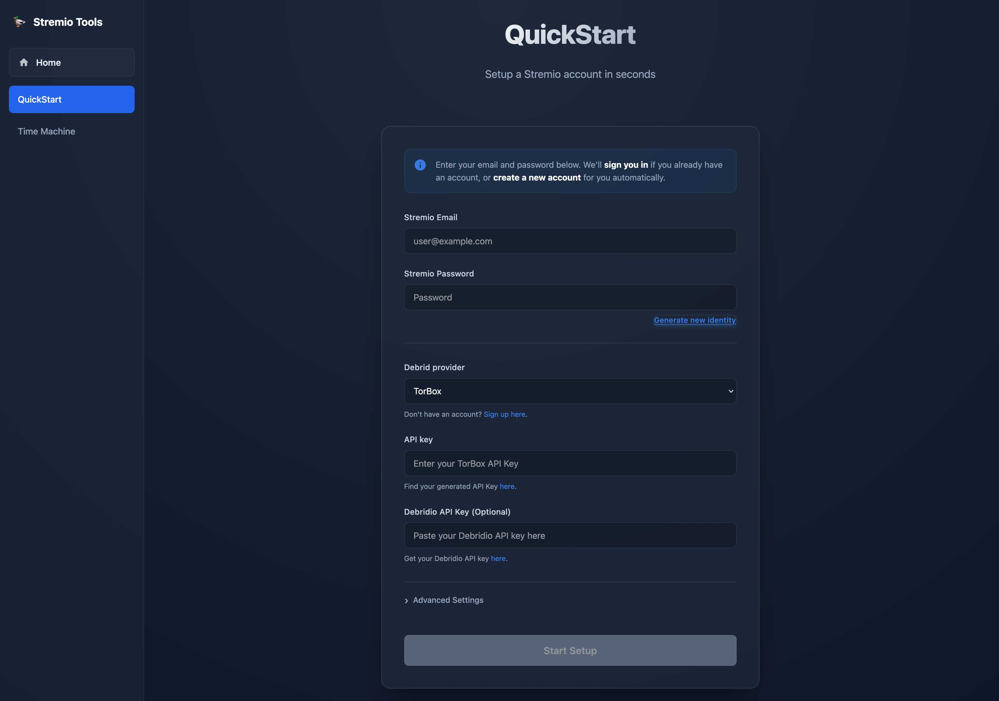

# QuickStart ⚡

**QuickStart** is the fastest way to set up a fully configured Stremio account. It handles the boring stuff—account creation, Debrid configuration, and addon installation—in a single, streamlined wizard.

## ✨ Features

- **⚡ Instant Setup**: Go from zero to watching in under 30 seconds.
- **🆔 Identity Generation**: Auto-generate a fresh email/password identity for privacy or testing.
- **🔌 Debrid Integration**: Seamlessly connects with **TorBox** or **Real-Debrid** to unlock high-speed streams.
- **📦 Smart Addons**: Automatically installs and configures the essential addons so you don't have to hunt for them.
- **🛡️ Auto-Retry**: Detecting valid API keys and handling transient errors automatically.

## 🚀 Getting Started

[👉 Open QuickStart](https://duckkota.gitlab.io/stremio-tools/quickstart/)

1.  **Enter Credentials**: Type your desired Stremio email/password, or click **Generate new identity** to create random ones.
2.  **Select Provider**: Choose your Debrid provider (e.g., TorBox) and paste your API Key.
3.  **Start Setup**: Click **Start Setup**. The tool will:
    -   Create your Stremio account (if it doesn't exist).
    -   configure AIOStreams with your Debrid key.
    -   Install the addons to your account.
    -   Show you a success message with your login details.

## 🛠️ How It Works

QuickStart acts as an orchestrator for the Stremio ecosystem:

1.  **Stremio API**: It authenticates directly with stremio.com to manage your account and addons.
2.  **AIOStreams API**: It communicates with the AIOStreams backend to generate a valid manifest URL containing your Debrid configuration.
3.  **TMDB**: It fetches valid API keys to ensure metadata addons work correctly.

---

*Note: For advanced users who want to manage snapshots of their existing accounts, check out [Time Machine](../time-machine).*
